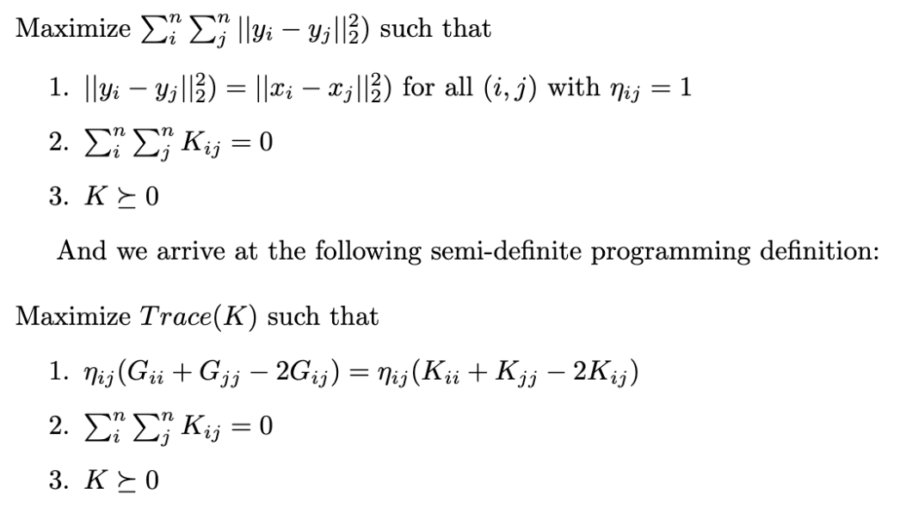
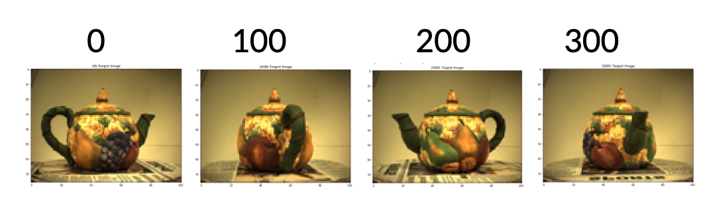
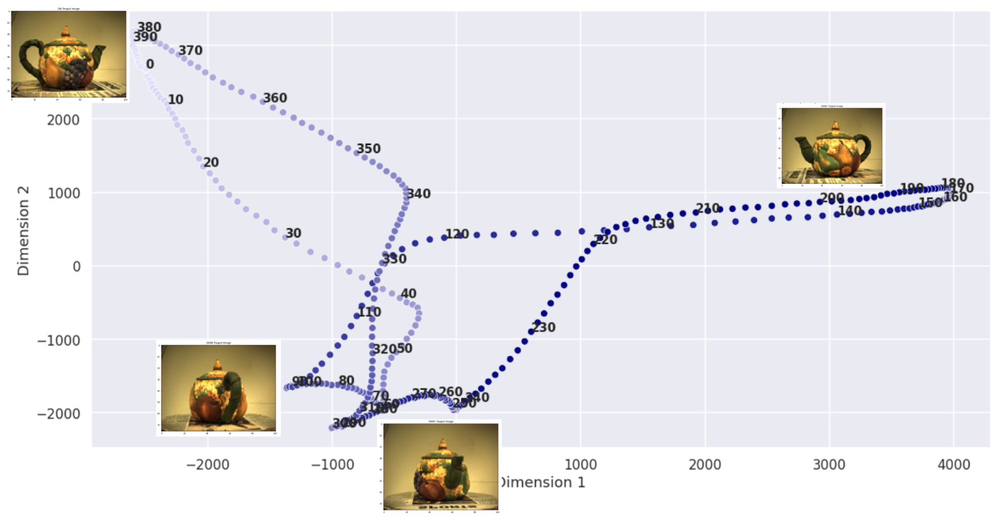
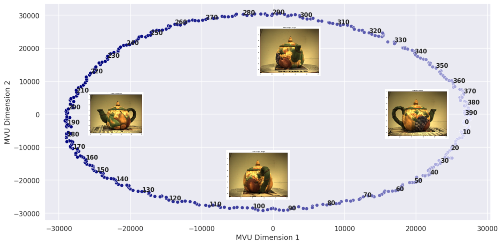
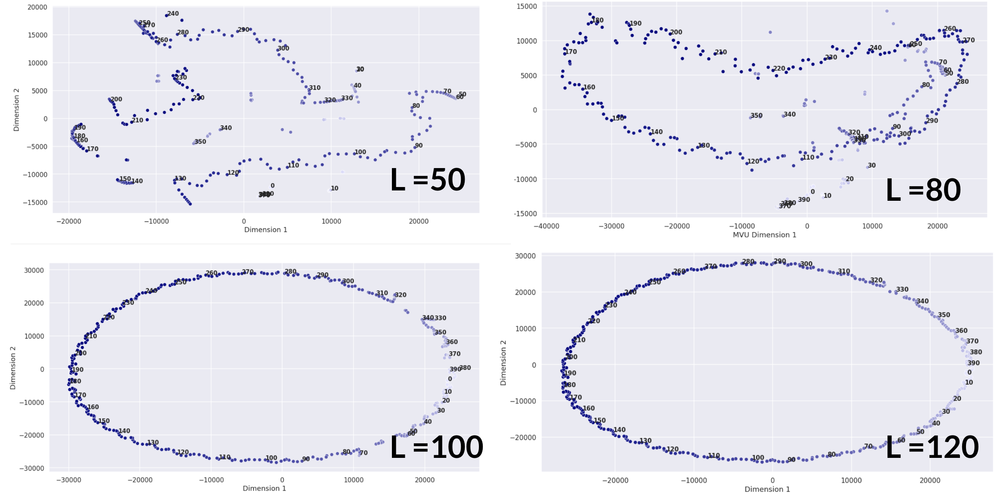
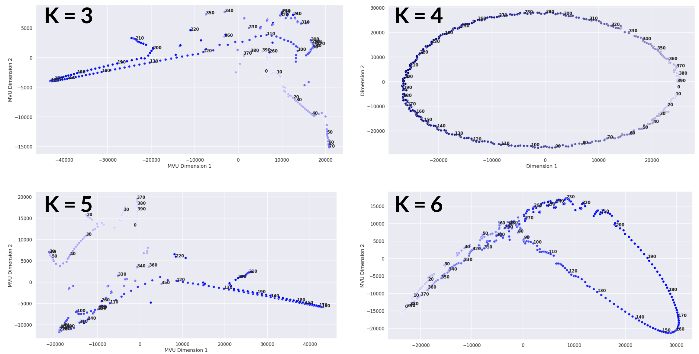

# Maximum-Variance-Unfolding
#### Name: Sam Longenbach & Caleb Ralphs

#### Files:
- **MVU_Teapot_Code.ipynb** - *Code to implement landmark MVU on teapot dataset varying (k) nearest neighbors and (L) landmarks.*
- **Maximum_Variance_Unfolding.pdf** - *Report detailing MVU derivation, summary of implementation, and discussion of further extensions.*
- **Teapots.mat** - *Data of 400 ordered images of rotated teapot.*

## Formulation

Maximum variance unfolding (MVU), also known as semi-definite embedding, is a non-linear dimension reduction technique.  It can be viewed as nonlinear generalization of the linear dimension reduction technique, principal component analysis (PCA). Like many dimension reduction algorithms, MVU looks to map high dimensional inputs to low dimensional outputs. The visual intuition behind MVU is this idea we connect neighboring points in the high dimensional space by rigid rods.  The amount of connections or number of rods is a chosen parameter (k)  we  will  discuss  later  on.   With  that  said,  the  points  connected  to  their  k closest neighbors creates this lattice like structure.  MVU can be seen as pulling this structure apart and flattening the structure without breaking or stretching the rigid rods. In other words, MVU looks to maximize the pairwise distances between input points subject to the constraints of maintaining the distances of these local connections.  

## Data

The teapot data set contains a 400 image sequence of a teapot being slowly rotated in a circle.  Each rgb image in the data set has 76x101x3 = 23,028 pixels or dimensions. Above is shows the 0th, 100th, 200th, 300th teapot indexes.  

## Implementation

#### PCA projection of 400 teapot images:

For sake of comparison we start by implementing PCA on the data.  Above you can see an issue PCA has.  PCA appears to struggle in discerning the difference between the handle and spout of the teapot.  In the 2D displayed projection these rotations are appear to be together.

#### MVU projection of 400 teapot images with k=4, L=120:

Below we tested varying the initial number of knearest neighbors (k) and varying landmarks (L). When  the  correct  parameters (k) and (L) are  found,  MVU  excels  at  finding the underlying dimension of the teapot images that being a circle. 

####  MVU projection of fixing k=4, and varying L:

####  MVU projection of fixing L=120, and varying k:

